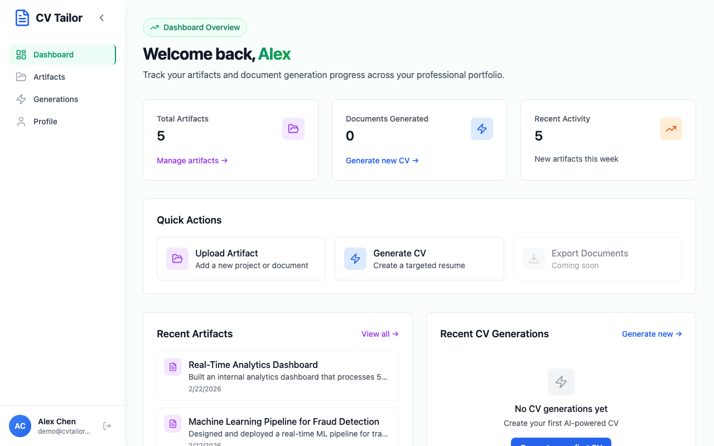

# VibeFlow

[](https://opensource.org/licenses/MIT)
[](https://github.com/hardness1020/VibeFlow/stargazers)

## What is VibeFlow?

VibeFlow is a docs-first development workflow for [Claude Code](https://docs.anthropic.com/en/docs/claude-code). Clone it into your project and it enforces the discipline that vibe coding usually skips: **write specs first, then tests, then code**, with guardrails that block you from cutting corners.

Three layers make this work:

- **Workflow**: A staged pipeline that walks you from spec to ship, with validated checkpoints between each phase. Four track sizes (Micro → Large) so a config tweak doesn't need the same process as a new auth system.
- **Guardrails**: Hooks that run on every prompt. They block work on `main`, prevent stage-skipping, and validate your docs automatically. No self-reporting.
- **Agents**: Specialized roles locked to their job. The test-writer can't touch source code. The implementer can't edit tests. Each agent sees only the tools it needs.

The result: **specs that actually drive tests, tests that actually drive code, and decisions that are traceable from doc to branch to PR.**

## Projects Using VibeFlow: Open a PR to add yours!

| Project | Description |
|:---:|---|
| <a href="https://github.com/hardness1020/CV-Tailor"></a> | **[CV-Tailor](https://github.com/hardness1020/CV-Tailor)**: A full-stack app that transforms work artifacts (GitHub repos, PDFs, web content) into customized, job-specific CVs and cover letters using OpenAI API. |

## The Pipeline


## Quick Start

```bash
git clone https://github.com/hardness1020/VibeFlow.git
```

**Step 1 — Clarify your idea** *(optional)*

```
/clarify-demand
```

Describe what you want to build. VibeFlow asks clarifying questions and checks feasibility before you commit to a plan.

**Step 2 — Register a work item**

```
/manage-work register "Add search feature" 1 small
```

This creates a `feat/add-search-feature` branch, picks the right track (Micro/Small/Medium/Large), and starts tracking your progress.

**Step 3 — Write your spec**

```
/create-feature-spec 1 add-search-feature
```

Produces a feature spec with acceptance criteria and API design. For larger tracks, you'll also use `/define-prd`, `/analyze-codebase`, `/define-tech-spec`, and `/record-decision` in earlier stages.

**Step 4 — TDD cycle: red → green → refactor**

```
/run-tdd red        # write failing tests from spec
/run-tdd green      # write minimal code to pass
/run-tdd refactor   # clean up with integration tests
```

**Step 5 — Close and merge**

```
/manage-work close 1
```

Validates that implementation is complete (Checkpoint #4), marks the work item as DONE, and you're ready to merge.

**Customizing for your project** *(optional)*

Copy the local overrides template to set personal preferences (test runner, language style, environment details):

```bash
cp .claude/CLAUDE.local.md.example CLAUDE.local.md
```

`CLAUDE.local.md` is gitignored — it won't affect other contributors.

---

## For Contributors & Advanced Users

Everything below is for people modifying VibeFlow itself or wanting to understand the internals.

### Workflow Pipeline

Each stage produces a specific artifact. See [the pipeline diagram](#the-pipeline) above for stage flow, track sizes, and checkpoint gates.

| Stage | Name | Purpose | Output |
|-------|------|---------|--------|
| A | Initiate | Define what to build, why it matters, and how to measure success | PRD |
| B | Discovery | Analyze existing codebase for dependencies, patterns, and risks | Discovery doc |
| C | Specify | Design architecture, data flow, and API contracts | Tech spec |
| D | Decide | Record non-trivial choices with alternatives and rationale | ADRs |
| E | Plan | Break the feature into implementable units with acceptance criteria | Feature spec |
| F | Test (RED) | Write failing tests that define expected behavior from the spec | Failing tests |
| G | Implement (GREEN) | Write minimal code to make all tests pass | Passing code |
| H | Refactor | Clean up code and add integration test coverage | Clean code |
| I | Reconcile | Update docs and specs to match what was actually built | Updated docs |
| J | Prepare | Write step-by-step deploy and rollback instructions | OP-NOTE |
| K | Deploy | Execute the runbook and verify in production | Live feature |
| L | Close | Tag the release and update indices | Closed item |

```
TRACKS (define planning depth, release is always optional):
─────────────────────────────────────────────────────────────
Large:   A ─────────────────────────────────────────────► H → DONE or I-L
Medium:      B ─────────────────────────────────────────► H → DONE or I-L
Small:                 E ───────────────────────────────► H → DONE or I-L
Micro:                           F ─────────────────────► G → DONE

BRANCH LIFECYCLE:
─────────────────
Register ──► git checkout -b feat/<slug>
   │              │
   │         (all work on this branch)
   │              │
   └──► Close/Done ──► merge feat/<slug> → main
```

### Tracks

| Track | Scope | Stages | Release | Example |
|-------|-------|--------|---------|---------|
| **Micro** | Bug fix, typo | F → G → DONE | No | Fix typo, update config |
| **Small** | Single feature | E → F → G → H → DONE | Optional (I-L) | Add form field, UI polish |
| **Medium** | Multi-component | B → C → D → E → F → G → H → DONE | Optional (I-L) | New API endpoint |
| **Large** | System change | A → B → C → D → E → F → G → H → DONE | Optional (I-L) | New auth system |

### Skills

#### Workflow Management

| Skill | Purpose |
|-------|---------|
| `/manage-work` | Register, track, advance, close work items |
| `/clarify-demand` | Pre-register demand clarification |
| `/validate-checkpoint` | Checkpoint validation and enforcement |

#### Stage Skills

| Skill | Stage | Purpose |
|-------|-------|---------|
| `/define-prd` | A | PRDs (Product Requirements Documents) with success metrics |
| `/analyze-codebase` | B | Codebase discovery and analysis |
| `/define-tech-spec` | C | Tech specs with architecture |
| `/record-decision` | D | ADRs (Architecture Decision Records) for non-trivial choices |
| `/create-feature-spec` | E | Feature specs with acceptance criteria |
| `/run-tdd` | F-H | TDD (Test-Driven Development) cycle: RED → GREEN → REFACTOR |
| `/prepare-release` | I-L | Reconcile, OP-NOTE, deploy, close |

### Enforcement (Hooks)

Hooks run automatically and deterministically — all are read-only (no file mutations). All fail open.

| Hook | Trigger | Fires On | Outcome | Reads |
|------|---------|----------|---------|-------|
| `workflow-state-inject.py` | Every prompt | `UserPromptSubmit` | Injects `[VibeFlow] Active: <slug> (Stage X, feat/<slug>)` | Manifest |
| `workitem-branch-guard.py` | Every prompt | `UserPromptSubmit` | **Blocks** if branch ≠ active `feat/<slug>` (manage-work/clarify-demand exempt) | Manifest |
| `checkpoint-gate.py` | Every prompt | `UserPromptSubmit` | **Blocks** advance/close if checkpoint not passed | Manifest + `validate_checkpoint.py` |
| `git-push-guard.py` | Bash with `git push` | `PreToolUse` | **Advisory**: warns if branch/checkpoint issues before push | Manifest |
| `auto-validate.py` | Conversation end | `Stop` | Shows doc validation pass/fail feedback | Validation scripts |
| `doc-path-tracker.py` | Conversation end | `Stop` | **Warns** if document paths missing from manifest | Manifest |
| `stage-transition-update.py` | Conversation end | `Stop` | Reminds to advance if artifacts exist | Manifest |

### Agents

Specialized subagents with tool restrictions enforced by scoped PreToolUse hooks. Each agent can only write to its designated file types.

| Agent | Stages | Tools | Scoped Hook | Purpose |
|-------|--------|-------|-------------|---------|
| `codebase-analyst` | B | Read, Grep, Glob | — | Analyze codebase, map dependencies |
| `spec-drafter` | C-D | Read, Grep, Glob, Write, Edit | `enforce-docs-only.py` | Draft specs and ADRs (`docs/` only) |
| `api-researcher` | E | Read, Grep, Glob | — | Analyze existing API patterns |
| `test-writer` | F | Read, Grep, Glob, Write, Edit, Bash | `enforce-test-files-only.py` | Create stubs + write failing tests |
| `implementer` | G | Read, Grep, Glob, Write, Edit, Bash | `enforce-no-test-no-doc.py` | Implement to pass tests (source only) |

Agent definitions: `.claude/agents/`

### Rules

Claude Code auto-loads these files from `.claude/rules/` as context:

| File | Covers |
|------|--------|
| `workflow-stages.md` | Stage definitions, track sizes, checkpoint gates |
| `branch-conventions.md` | `feat/<slug>` format, branch lifecycle |
| `file-naming.md` | Document paths and directory hierarchy |
| `skills-reference.md` | Skill-to-stage mapping and commands |
| `agents-reference.md` | Agent tool restrictions and scoped hooks |
| `skills-development.md` | Creating skills: directory structure, `SKILL.md` format, naming |
| `hooks-development.md` | Creating hooks: input/output format, exit codes, fail-open principle |
| `docs-standards.md` | Required sections for each document type (PRD, ADR, Feature Spec, etc.) |

---

## Contributing

Contributions welcome. Before modifying VibeFlow internals, review the development conventions in `.claude/rules/` (see [Rules Reference](#rules-reference) above). Follow the workflow when contributing and test your changes.

## License

[MIT](LICENSE)
